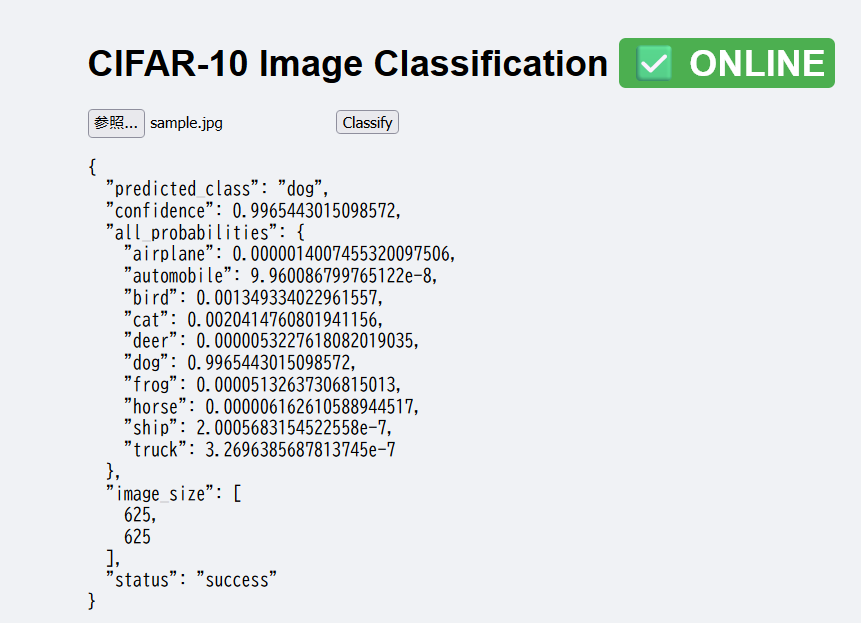

"Note: This project is part of my my-ai-portfolio repository."

# 🖼️ CIFAR-10 Image Classifier

A deep learning-powered image classification API built with PyTorch and FastAPI.
This project provides a production-ready API that predicts one of the 10 CIFAR-10 categories from an input image.



## 🏷️ Categories

The model predicts one of the following 10 classes:

* ✈️ Airplane
* 🚗 Automobile
* 🐦 Bird
* 🐱 Cat
* 🦌 Deer
* 🐕 Dog
* 🐸 Frog
* 🐴 Horse
* 🚢 Ship
* 🚚 Truck

## 🚀 Tech Stack

* **PyTorch**: Model definition and inference
* **FastAPI**: REST API
* **Uvicorn**: ASGI server
* **Docker**: Deployment for Hugging Face Spaces
* **GitHub**: Version control

## 📂 Project Structure

```text
cifar10-classifier/
    app/
        main.py
        model.py
        cifar10_model.pth
    assets/
        demo_result.png
    notebooks/
        training.ipynb
    Dockerfile
    requirements.txt
    README.md
    .gitignore
```

## 🧠 Model Description

Simple CNN architecture:

```text
Input (3×32×32)
↓
Conv2D(32) + ReLU
MaxPool2D
↓
Conv2D(64) + ReLU
MaxPool2D
↓
Flatten
Fully Connected(512) + ReLU
Fully Connected(10 outputs)
```

The model is trained in `notebooks/training.ipynb`, saved as `cifar10_model.pth`, and loaded by the FastAPI app from the `app/` directory during inference.

Note: In this project, the model file is stored inside the app/ directory to ensure
it is packaged correctly when deploying on Hugging Face Spaces with Docker.


## 📦 Installation

### 1. Clone the repository

```bash
git clone https://github.com/tomisaito/my-ai-portfolio.git
cd my-ai-portfolio/cifar10-image-classifier
```

### 2. Install dependencies

```bash
pip install -r requirements.txt
```

### 3. Run FastAPI server locally

```bash
uvicorn app.main:app --host 0.0.0.0 --port 8000
```

### 4. Access the API

* OpenAPI Docs: [http://localhost:8000/docs](http://localhost:8000/docs)
* Predict endpoint: `POST http://localhost:8000/predict`

## 🔌 API Usage

### cURL Example

```bash
curl -X POST "http://localhost:8000/predict" \
  -H "accept: application/json" \
  -H "Content-Type: multipart/form-data" \
  -F "file=@cat.jpg"
```

### Python Example

```python
import requests

url = "http://localhost:8000/predict"

with open("cat.jpg", "rb") as f:
    files = {"file": f}
    response = requests.post(url, files=files)

print(response.json())
```

### Response example

```json
{
  "predicted_class": "cat",
  "confidence": 0.8542,
  "all_probabilities": {
    "airplane": 0.01,
    "automobile": 0.02,
    "bird": 0.03
  }
}
```

## 🐳 Docker Usage

### Build image

```bash
docker build -t cifar10-classifier .
```

### Run container

```bash
docker run -d -p 8000:8000 cifar10-classifier
```

## 🚀 Deployment to Hugging Face Spaces

Steps:

1. Create a new Space on Hugging Face
2. Choose **Docker** as SDK
3. Clone your Space repository
4. Copy this project’s files
5. Push:

```bash
git add .
git commit -m "Deploy CIFAR-10 classifier"
git push
```

Your API will be deployed at:
`https://huggingface.co/spaces/tomisaito/cifar10-classifier`

## 📈 Model Performance

| Metric            | Value            |
| ----------------- | ---------------- |
| Training Accuracy | ~75%             |
| Test Accuracy     | ~70%             |
| Inference speed   | <100ms per image |

*Note: For production, transfer learning (ResNet, EfficientNet) is recommended.*

## 🧪 Testing

```bash
curl -X POST "http://localhost:8000/predict" \
  -F "file=@test_images/cat.jpg"
```

## 📈 Future Improvements

* [ ] Improve accuracy with data augmentation
* [ ] Add support for batch inference
* [ ] Add ResNet/EfficientNet versions
* [ ] Add metadata logging and model versioning
* [ ] Add CI/CD automation

## 📝 License

MIT License

## 🙏 Acknowledgments

* PyTorch
* FastAPI
* CIFAR-10 dataset
* Hugging Face Spaces