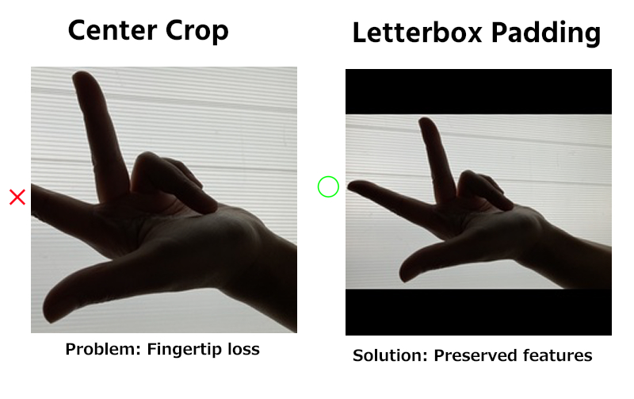

# Hand Gesture Classifier (Fleming's Left Hand Rule)

This project is a deep learning model to classify three specific left-hand gestures. It prioritizes data integrity and domain-specific logic to achieve high robustness.

## Highlights

* **Target**: 3 classes (Open Palm, Thumbs Up, Fleming's Left Hand)
* **Model**: ResNet18 (Transfer Learning)
* **Performance**: Achieved **96.67%** test accuracy
* **Dataset**: 150 self-collected images (50 per class)

## 🛠 Data Engineering & Problem Solving

### 1. Proactive Quality Control: Letterbox Padding

During the pre-training data inspection, I noticed that standard center-cropping cut off essential fingertip information due to the smartphone's aspect ratio.

* **Solution**: Implemented **Letterbox Padding** to resize images to 224x224 while maintaining the original aspect ratio.
* **Impact**: Preserved 100% of gesture features, preventing model confusion.


*Figure 1: Comparison between Center-Crop (loss of information) and Letterbox Padding (preservation of fingertip features)*

### 2. Physics-Aware Augmentation

I deliberately disabled **Horizontal Flip** in the data augmentation pipeline.

* **Logic**: Fleming's Left Hand Rule is orientation-specific. Flipping the image would transform it into a "right-hand" gesture, introducing false labels to the training set.
* **Strategy**: Focused on rotation, brightness jitter, and zoom to ensure robustness without breaking physical laws.

### 3. Traceability and Efficiency

* **Naming Convention**: Automated renaming to `class_mode_number.jpg` for better dataset management and traceability.
* **Data Augmentation**: Programmatically flipped right-hand photos to expand the left-hand dataset efficiently.

## Usage

This application provides a simple Gradio UI for testing the trained model.

1. Install dependencies:
```bash
pip install -r requirements.txt

```


2. Run the application:
```bash
python app.py

```


3. Running Tests: To verify the model and script integrity, run:
```bash
pytest tests/test_model.py

```


## Environment

* **Platform**: Google Colab
* **Framework**: PyTorch
* **UI**: Gradio
